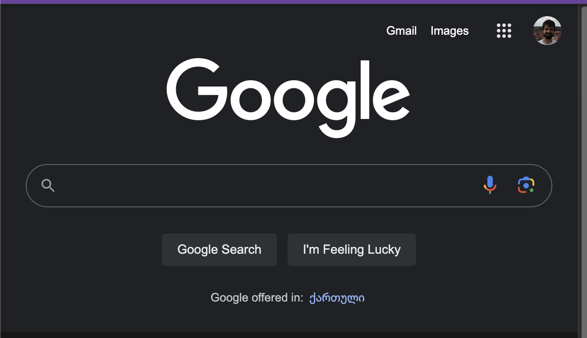

@browser open google

###### State: Current Page [1]

- No page open

**browser**

###### Steps

- Visit Page [1] `{"url":"https://www.google.com"}`

###### Execution: Visit Page [1]

<pre class='output' style='display:none'>
Exit Code: 0
</pre>

-[x] Done

###### Current State: URL [1]

https://www.google.com

###### Current State: Screenshot [1]

###### Current State: HTML [1]

[html](html)

<pre class='output' style='display:none'>
<body><a>Gmail</a><a>Images</a><form action="/search" method="GET">
<input value="Google Search" name="btnK" type="submit"><input value="I'm Feeling Lucky" name="btnI" type="submit">
</form>Google offered in:    <a>ქართული</a>Georgia<a>About</a><a>Advertising</a><a>Business</a><a> How Search works </a><g-popup>Settings<g-menu><g-menu-item><a>Search settings</a></g-menu-item><g-menu-item><a>Advanced search</a></g-menu-item><g-menu-item><a>Your data in Search</a></g-menu-item><g-menu-item><a>Search history</a></g-menu-item><g-menu-item><a>Search help</a></g-menu-item><g-menu-item>Send feedback</g-menu-item><g-menu-item></g-menu-item><g-menu-item>Dark theme: On</g-menu-item></g-menu></g-popup><a>Privacy</a><a>Terms</a></body>
</pre>

**browser** The Google homepage has been successfully opened. What would you like to do next?

**user**
