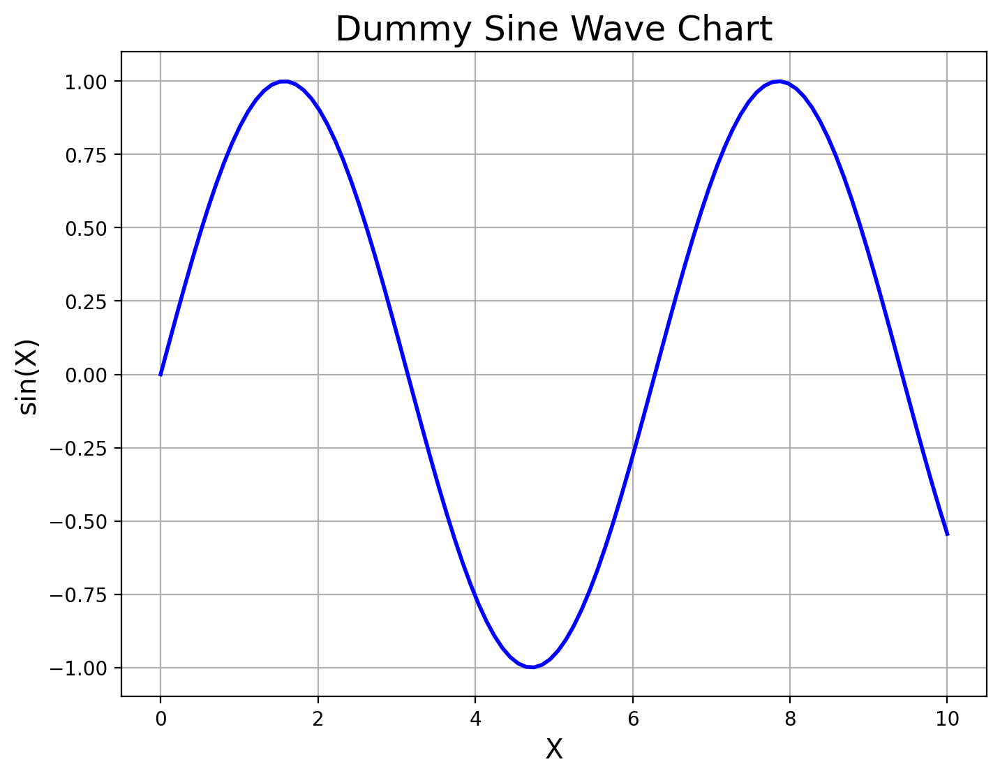
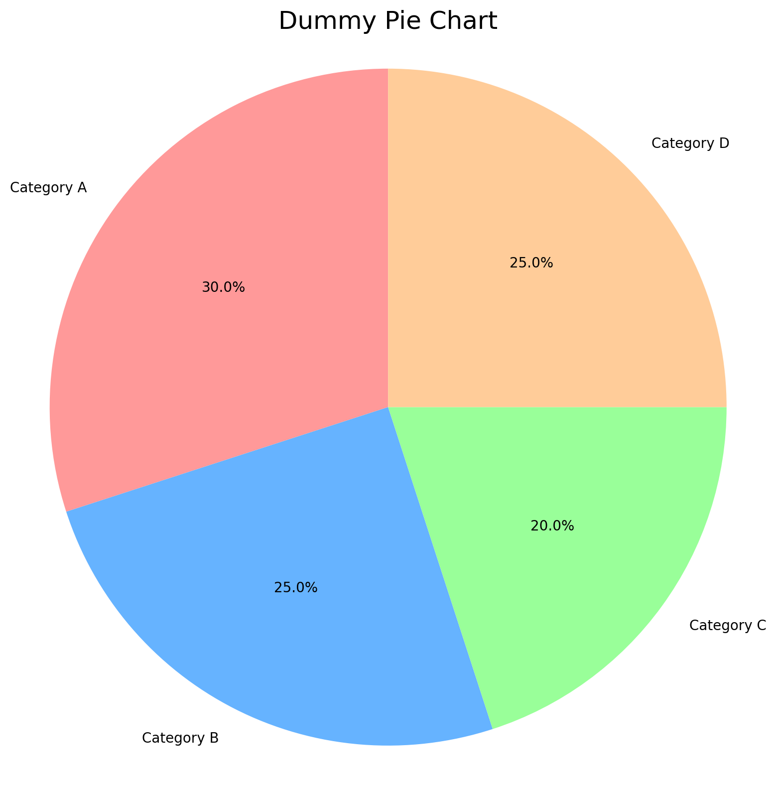

@jupyter show a dummy chart

**jupyter** Here is a dummy chart using matplotlib:

```python .eval
%matplotlib inline
import matplotlib.pyplot as plt
import numpy as np

x = np.linspace(0, 10, 100)
y = np.sin(x)

plt.figure(figsize=(8, 6))
plt.plot(x, y, 'b-', linewidth=2)
plt.title('Dummy Sine Wave Chart', fontsize=18)
plt.xlabel('X', fontsize=14)
plt.ylabel('sin(X)', fontsize=14)
plt.grid(True)
plt.show()
```

###### Cell Output: &lt;Figure size 800x600 with 1 Axes&gt; [cell_0]

</pre>

**jupyter** Great, the dummy chart was generated successfully using matplotlib. Let me know if you need any other charts or have additional requirements!

**user** good. another one

**jupyter** Sure! Here's another one:

```python .eval
%matplotlib inline
import matplotlib.pyplot as plt
import numpy as np

# Generate data for the chart
categories = ['Category A', 'Category B', 'Category C', 'Category D']
values = [25, 40, 15, 20]

# Set up the figure and axes
fig, ax = plt.subplots(figsize=(8, 6))

# Create the bar chart
ax.bar(categories, values, color='skyblue', edgecolor='black', linewidth=1)

# Customize the chart
ax.set_title('Dummy Bar Chart', fontsize=18)
ax.set_xlabel('Categories', fontsize=14)
ax.set_ylabel('Values', fontsize=14)
ax.tick_params(axis='both', labelsize=12)

# Add value labels on top of each bar
for i, v in enumerate(values):
    ax.text(i, v + 0.5, str(v), ha='center', fontsize=12)

# Display the chart
plt.tight_layout()
plt.show()
```

Here's another dummy chart, this time using a bar chart:

The code generates a bar chart with custom categories and values. It sets up the figure and axes, creates the bar chart with customized colors and line width, adds labels and title to the chart, and displays the value of each bar on top of it.

Feel free to modify the categories, values, colors, and other chart properties as needed.

###### Cell Output: &lt;Figure size 800x600 with 1 Axes&gt; [cell_0]

</pre>

**jupyter** Excellent! The dummy bar chart is generated as requested. It showcases different categories along the x-axis and their corresponding values on the y-axis. The chart is visually appealing with customized colors, labels, and value labels on top of each bar.

Here are a few more ideas for dummy charts you can create:

1. Pie Chart: Illustrate the distribution of data among different categories using a pie chart.

2. Line Chart: Show the trend or progression of data over time using a line chart.

3. Scatter Plot: Visualize the relationship between two variables using a scatter plot.

4. Stacked Bar Chart: Compare multiple categories and their sub-categories using a stacked bar chart.

5. Heatmap: Represent data using color-coded cells in a matrix format.

Let me know if you would like me to generate any of these dummy charts or if you have any specific requirements for your next chart.


**user** one more

**jupyter** Certainly! Here's a dummy pie chart:

```python .eval
%matplotlib inline
import matplotlib.pyplot as plt

# Define the data for the pie chart
labels = ['Category A', 'Category B', 'Category C', 'Category D']
sizes = [30, 25, 20, 25]
colors = ['#ff9999', '#66b3ff', '#99ff99', '#ffcc99']

# Create a figure and a set of subplots
fig, ax = plt.subplots(figsize=(8, 8))

# Create the pie chart
ax.pie(sizes, labels=labels, colors=colors, autopct='%1.1f%%', startangle=90)

# Equal aspect ratio ensures that pie is drawn as a circle
ax.axis('equal')  

# Add a title
plt.title("Dummy Pie Chart", fontsize=18)

# Display the chart
plt.tight_layout()
plt.show()
```

This code generates a visually appealing pie chart:

The pie chart illustrates the distribution of data among different categories. It uses custom labels, sizes, and colors for each slice of the pie. The `autopct` parameter is used to display the percentage of each slice on the chart itself.

The chart is drawn with an equal aspect ratio to ensure it appears as a perfect circle. A title is added to provide context to the chart.

Feel free to modify the labels, sizes, colors, and other chart properties to suit your specific requirements.

Let me know if you need any further assistance or have additional chart requests!


###### Cell Output: &lt;Figure size 800x800 with 1 Axes&gt; [cell_0]

</pre>


