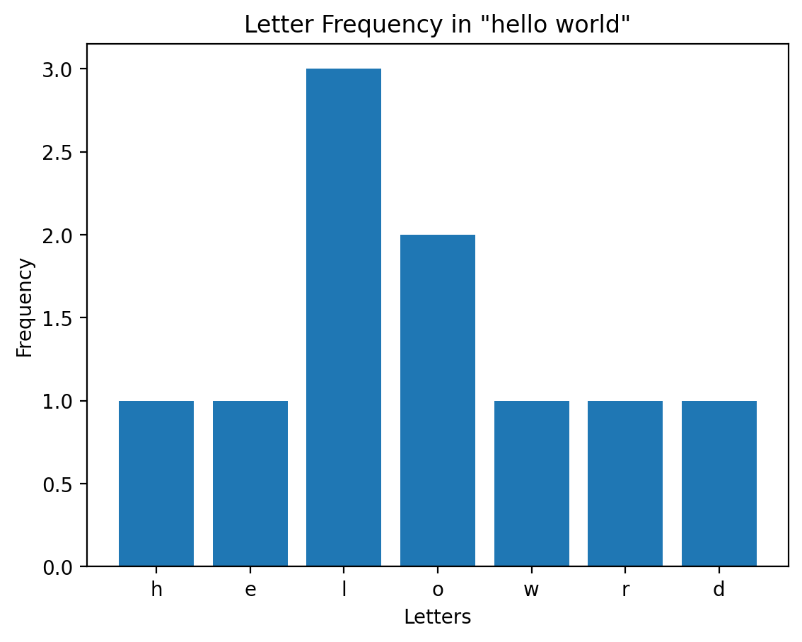

### Outputs

Let's run some code snippets and see the output.

###### Some shell commands:

```python .eval
!date
```

###### The current directory:

```python .eval
!pwd
```

###### A plot:

```python .eval
import matplotlib.pyplot as plt
from collections import Counter

# Sample text
text = "hello world"
letter_counts = Counter(text.replace(" ", ""))  # Count letters, ignore spaces

# Data for plotting
labels, values = zip(*letter_counts.items())

plt.figure()
plt.bar(labels, values)
plt.title('Letter Frequency in "hello world"')
plt.xlabel('Letters')
plt.ylabel('Frequency')
plt.show()
```
###### An error:

```python .eval
foo
```

---

###### Cell Output: stdout [cell_0]

<pre>
Fri May  3 12:21:11 CEST 2024
</pre>

###### Cell Output: stdout [cell_1]

<pre>
/private/var/demos/taskmates-demo/demo/9. Jupyter environment
</pre>

###### Cell Output: &lt;Figure size 640x480 with 1 Axes&gt; [cell_2]

</pre>

###### Cell Output: error [cell_3]

<pre>

---------------------------------------------------------------------------
NameError                                 Traceback (most recent call last)
Cell In[5], line 1
----> 1 foo

NameError: name 'foo' is not defined

</pre>

